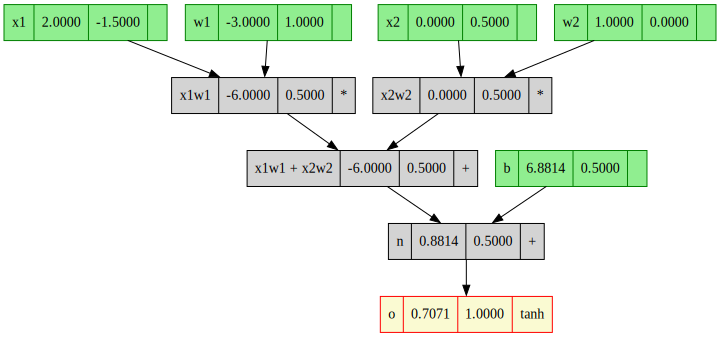
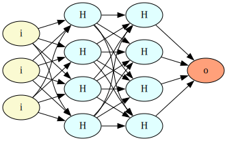
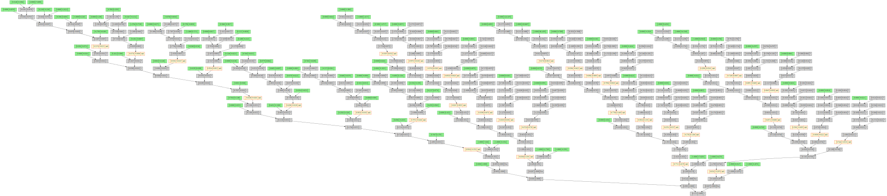

# micrograd_cs
### Toy project

After watching the wonderful video from karpathy at https://www.youtube.com/watch?v=VMj-3S1tku0, I wanted to do a C# implementation just from memory so I understood the concepts correctly. This is just a repo of the progress. 
### Example Neuron

### Example Neural Network

### Loss Function Visualized

